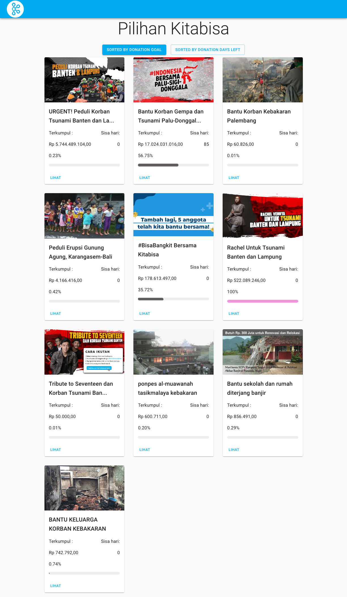

# kitabisa-fe-test

### Installation

1- Clone this repo
2- `cd kitabisa-fe-test`

3- `npm install` to install npm packages

4- start dev server using `npm run dev`.

5- open `http://localhost:3000` in your browser

## The App

### Dashboard Page
App would display list of campaigns as multiple rows

